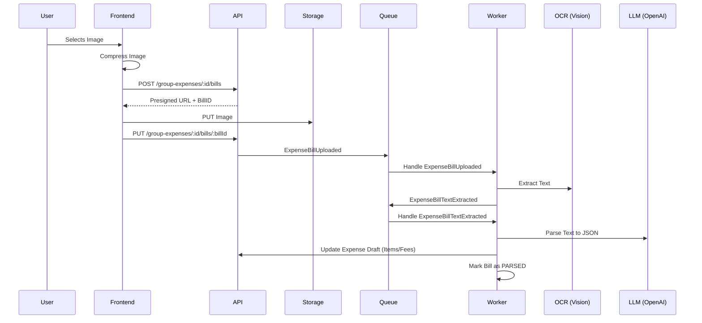

# Bill Upload & Parsing Flow

The bill upload system automates expense creation by extracting items and fees from receipt images using Google Vision (OCR) and OpenAI (LLM).

## Overview

The process is asynchronous and event-driven, involving the frontend, a Go backend API, and a worker system.

---

## 2. Upload Flow

The system uses a **presigned upload strategy** to improve reliability and reduce server load.

1. **Get Presigned URL**: Frontend sends `POST /api/v1/group-expenses/:id/bills`.
2. **Record Initialization**: API creates/reuses a DB record in `NOT_UPLOADED_BILL` status (or reuses an existing failed/incomplete record) and returns a unique PUT URL.
3. **Storage Upload**: Frontend performs a `PUT` request directly to Storage.
4. **Processing Trigger**: Frontend notifies API via `PUT /api/v1/group-expenses/:id/bills/:billId`, which enqueues `ExpenseBillUploaded`.

---

## 3. Asynchronous Processing

### Stage 1: Text Extraction (OCR)

- **Message**: `ExpenseBillUploaded`
- **Handler**: `ExpenseBillService.ExtractBillText`
- **Logic**:
  - Retrieves image from Storage.
  - Sends to **Google Cloud Vision API**.
  - Stores raw text in `expense_bills.extracted_text`.
  - Updates status to `EXTRACTED`.
  - Enqueues `ExpenseBillTextExtracted`.

### Stage 2: Structured Parsing (LLM)

- **Message**: `ExpenseBillTextExtracted`
- **Handler**: `GroupExpenseService.ParseFromBillText`
- **Logic**:
  - Sends raw text to **OpenAI** with a specialized system prompt.
  - **Prompt Instruction**: Extract `totalAmount`, `subtotal`, `items`, and `otherFees` into a strict JSON schema.
  - Discards invalid or zero-amount items.
  - Updates the linked `GroupExpense` draft with the extracted data.
  - Updates status to `PARSED`.

---

## 4. Bill Lifecycle Status

| Status              | Value               | Description                                        |
| ------------------- | ------------------- | -------------------------------------------------- |
| `NOT_UPLOADED`      | `NOT_UPLOADED`      | Presigned URL issued but upload not yet confirmed. |
| `PENDING`           | `PENDING`           | Uploaded, waiting for OCR.                         |
| `EXTRACTED`         | `EXTRACTED`         | OCR complete, waiting for LLM parsing.             |
| `FAILED_EXTRACTING` | `FAILED_EXTRACTING` | OCR failed to extract text from the image.         |
| `PARSED`            | `PARSED`            | Successfully parsed into expense items.            |
| `FAILED_PARSING`    | `FAILED_PARSING`    | LLM failed to parse structured data from text.     |
| `NOT_DETECTED`      | `NOT_DETECTED`      | LLM could not find valid receipt data in the text. |

---

## 5. Security & Constraints

- **File Limits**: Maximum file size is enforced at both API and Storage levels.
- **Allowed Extensions**: Only image MIME types (JPEG, PNG, WEBP) are accepted.
- **Subscription Limits**: Users may be restricted in the number of bills they can upload per month.
- **Ownership**: Only the expense creator can upload a bill to a draft.
